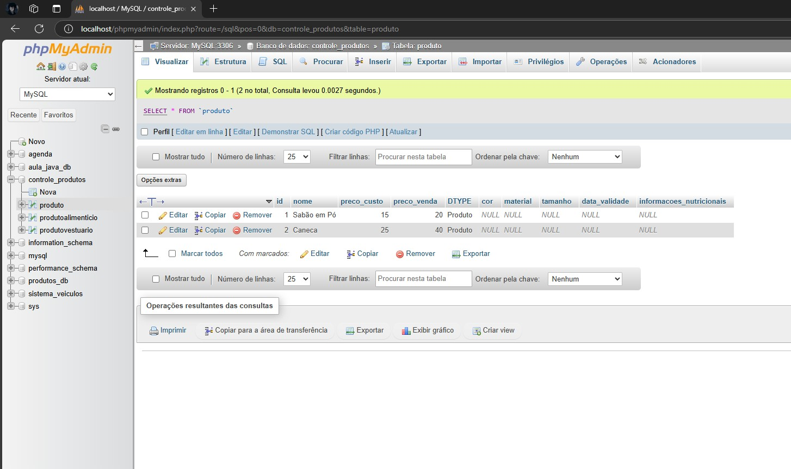

# CONTROLE PRODUTOS

Esta atividade é requisito da Avaliação Final

## 🚀 Começando

*Crie a classe Produto que possui os atributos nome, preço de custo e preço de venda. Possui também o método concreto calcularLucro.

*A classe ProdutoAlimenticio é derivada de Produto e possui os atributos data de validade e informações nutricionais.

*A classe ProdutoVestuario possui os atributos tamanho, cor e material.

*Todas as classes devem ter métodos para salvar, deletar e atualizar registros em um banco de dados relacional.

[Foto do Sistema Produtos no WAMP SERVER]

()

### 📋 Pré-requisitos

De que coisas você precisa para instalar o software e como instalá-lo?

*Java JDK.

*IDE Eclipse ou qualquer outra IDE.

*MySQL para ter um banco de dados.

*Driver JDBC para conexão com o banco de dados.

### 🔧 Instalação

Após abrir o pacote com o Arquivo para o programa executar, entre no Arquivo Main, onde estarão todas as informações de Input do programa, utilize os números de 1 a 5 para selecionar a opção desejada e siga utilizando os métodos do projeto para se ter uma lista de produtos cadastrados no seu programa

## 🛠️ Construído com

* IDE Eclipse
* JRE System Library
* Maven Dependencies
* WAMP SERVER

## 📌 Versão

* **Eclipse Installer 2024-09 R
* * Wamp Server 3.3.5
    
